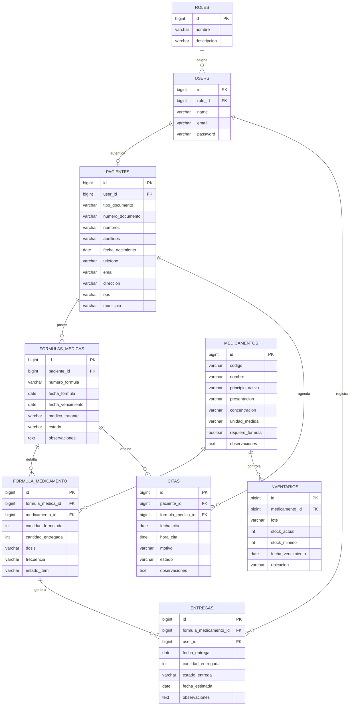

# Modelo Entidad Relacion

Este MER surge del alcance descrito en el documento del proyecto: importacion de formulas medicas, consulta de disponibilidad, seguimiento de pendientes y agendamiento de visitas.

Sugerencia para el entregable:

1. Abrir MySQL Workbench.
2. Crear un nuevo modelo EER.
3. Replicar las tablas y relaciones del diagrama anterior.
4. Exportar la captura del modelo como imagen para el informe.